README
================
Md. Zia Uddin Foisal
2022-06-16

``` r
library(dplyr)
```

    ## 
    ## Attaching package: 'dplyr'

    ## The following objects are masked from 'package:stats':
    ## 
    ##     filter, lag

    ## The following objects are masked from 'package:base':
    ## 
    ##     intersect, setdiff, setequal, union

``` r
library(ggplot2)
mpg
```

    ## # A tibble: 234 x 11
    ##    manufacturer model      displ  year   cyl trans drv     cty   hwy fl    class
    ##    <chr>        <chr>      <dbl> <int> <int> <chr> <chr> <int> <int> <chr> <chr>
    ##  1 audi         a4           1.8  1999     4 auto~ f        18    29 p     comp~
    ##  2 audi         a4           1.8  1999     4 manu~ f        21    29 p     comp~
    ##  3 audi         a4           2    2008     4 manu~ f        20    31 p     comp~
    ##  4 audi         a4           2    2008     4 auto~ f        21    30 p     comp~
    ##  5 audi         a4           2.8  1999     6 auto~ f        16    26 p     comp~
    ##  6 audi         a4           2.8  1999     6 manu~ f        18    26 p     comp~
    ##  7 audi         a4           3.1  2008     6 auto~ f        18    27 p     comp~
    ##  8 audi         a4 quattro   1.8  1999     4 manu~ 4        18    26 p     comp~
    ##  9 audi         a4 quattro   1.8  1999     4 auto~ 4        16    25 p     comp~
    ## 10 audi         a4 quattro   2    2008     4 manu~ 4        20    28 p     comp~
    ## # ... with 224 more rows

``` r
#Make a scatterplot of hwy and cyl. we can mapping the aesthestics to reveal extra information
# aesthestics could be size, shape, colors, alpha

ggplot(data = mpg)+
  geom_point(mapping = aes(x = displ, y = hwy), color = "red")+
  facet_wrap(~cyl)
```

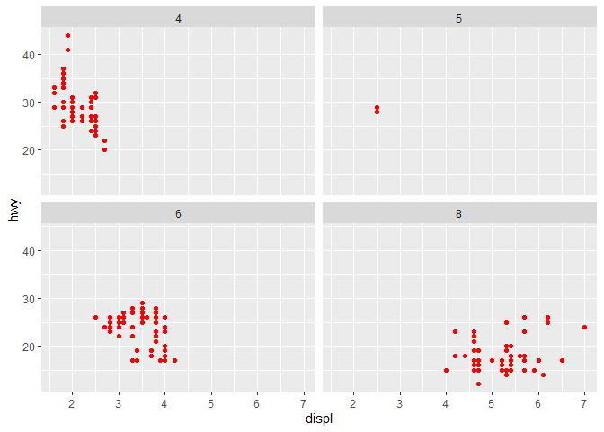<!-- -->

``` r
ggplot(data = mpg, mapping = aes(displ, hwy))+
  geom_point(mapping = aes(color = class))+
  geom_smooth()
```

    ## `geom_smooth()` using method = 'loess' and formula 'y ~ x'

<!-- -->

``` r
ggplot(data = mpg) +
  geom_point(mapping = aes(x = hwy, y = cty)) +
  facet_grid(drv ~ cyl)
```

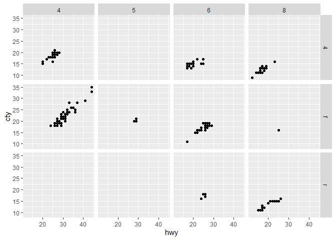<!-- -->

``` r
# drv ~ . facet by values of drv on the y-axis

ggplot(data = mpg)+
  geom_point(mapping = aes(displ,hwy))+
  facet_grid(drv~.)
```

<!-- -->

``` r
# While, . ~ cyl will facet by values of cyl on the x-axis.
ggplot(data = mpg)+
  geom_point(mapping = aes(displ,hwy))+
  facet_grid(. ~cyl)
```

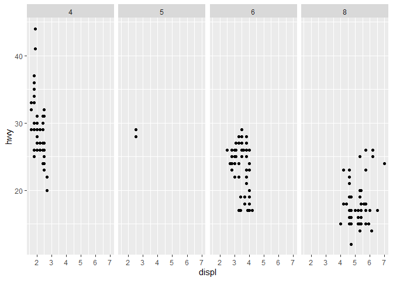<!-- -->

``` r
# Geomeetric objects


ggplot(data = mpg)+
  geom_smooth(mapping = aes(x = displ, y = hwy, linetype =  drv))
```

    ## `geom_smooth()` using method = 'loess' and formula 'y ~ x'

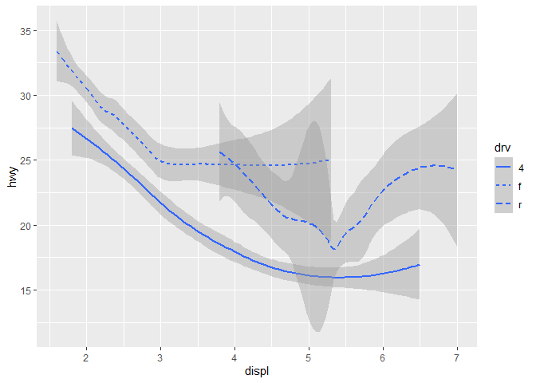<!-- -->

``` r
# GEOM_SMOOTH separates the cars into three lines based on car's drive train
 
ggplot(data = mpg)+
  geom_point(mapping = aes(x = displ, y = hwy, color = drv))+
  geom_smooth(mapping = aes(x  = displ, y = hwy,  color = drv))
```

    ## `geom_smooth()` using method = 'loess' and formula 'y ~ x'

<!-- -->

``` r
# geom smooth uses single geometric object to display multiple rows of data 
# For these geoms, you can set the grouping variable to a categorical variable

ggplot(data = mpg)+
  geom_smooth(mapping = aes(x = displ, y = hwy, group = drv))
```

    ## `geom_smooth()` using method = 'loess' and formula 'y ~ x'

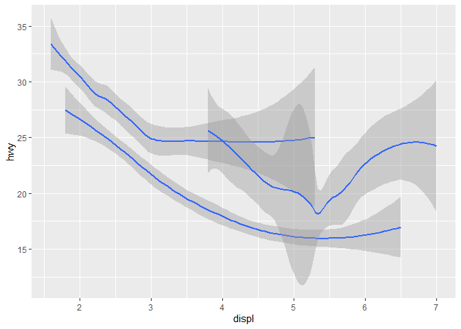<!-- -->

``` r
ggplot(data = mpg)+
  geom_smooth(mapping = aes(x = displ, y = hwy, color = drv)
              , show.legend = FALSE
              )
```

    ## `geom_smooth()` using method = 'loess' and formula 'y ~ x'

<!-- -->

``` r
# passing global mapping and local mapping

ggplot(data = mpg, mapping = aes(x = displ, y = hwy))+
  geom_point(mapping = aes(color = class))+
  geom_smooth()
```

    ## `geom_smooth()` using method = 'loess' and formula 'y ~ x'

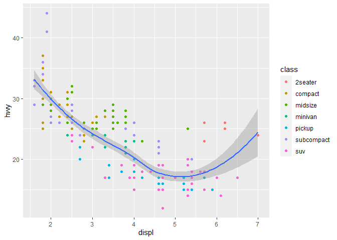<!-- -->

``` r
# local data argument overrides the global arguments in the geom smooth functions 

ggplot(data = mpg, mapping = aes(x = displ, y = hwy))+
  geom_point(mapping = aes(color = class))+
  geom_smooth(data = filter(mpg, class == "suv"), se = FALSE)
```

    ## `geom_smooth()` using method = 'loess' and formula 'y ~ x'

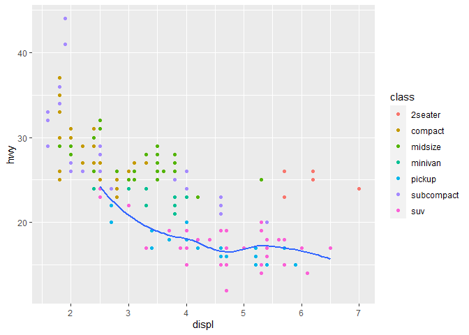<!-- -->

``` r
ggplot(data = mpg, mapping = aes(x = displ, y = hwy))+
  geom_point(mapping = aes(color = class))+
  geom_smooth(data = filter(mpg, class == "suv"))
```

    ## `geom_smooth()` using method = 'loess' and formula 'y ~ x'

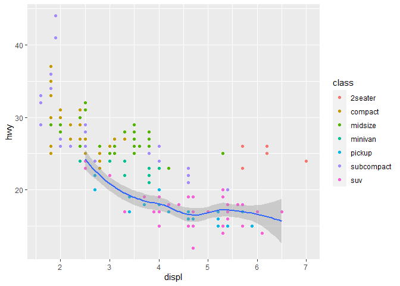<!-- -->

``` r
ggplot(data = mpg, mapping = aes(x = displ , y = hwy))+
  geom_point()+
  geom_smooth()
```

    ## `geom_smooth()` using method = 'loess' and formula 'y ~ x'

<!-- -->

``` r
ggplot(data = mpg, mapping = aes(x = displ , y = hwy))+
  geom_point()+
  geom_smooth(mapping = aes(group = drv),
              se = FALSE
              )
```

    ## `geom_smooth()` using method = 'loess' and formula 'y ~ x'

<!-- -->

``` r
ggplot(data = mpg, mapping = aes(x = displ , y = hwy, color = drv))+
  geom_point()+
  geom_smooth(data  = filter (mpg, drv == "r"), mapping = aes(color = drv),
              se = FALSE
  )
```

    ## `geom_smooth()` using method = 'loess' and formula 'y ~ x'

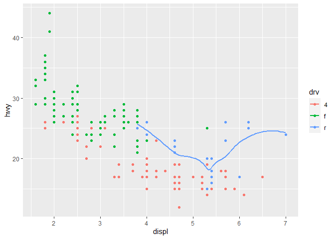<!-- -->

``` r
ggplot(data = mpg, mapping = aes(x = displ , y = hwy, color = drv))+
  geom_point()+
  geom_smooth( mapping = aes(linetype = drv),
              se = FALSE
  )
```

    ## `geom_smooth()` using method = 'loess' and formula 'y ~ x'

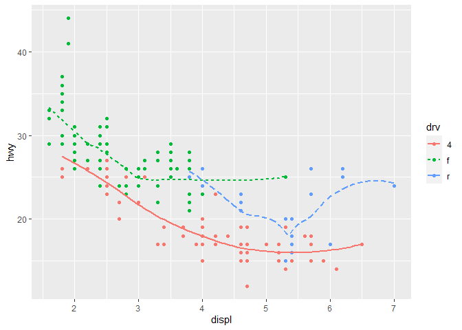<!-- -->

``` r
ggplot(data = mpg, mapping = aes(x = displ , y = hwy, color = drv))+
  geom_point(mapping = aes(color = drv))
```

<!-- -->

### STATISTICAL TRANSFORMATIONS

##### BAR CHART

``` r
ggplot(data = diamonds)+
  geom_bar(mapping = aes(x=cut))
```

<!-- -->

``` r
ggplot(data = diamonds) +
  stat_summary(mapping = aes(x = cut, y = depth))
```

    ## No summary function supplied, defaulting to `mean_se()`

<!-- -->

``` r
# stat_summary() summarises the y values for each unique x value, 
#to draw attention to the summary you are drawing

ggplot(data = diamonds) +
  stat_summary( mapping = aes(x = cut, y = depth),
               fun.ymin = min,
               fun.ymax = max,
               fun.y = median
              )
```

    ## Warning: `fun.y` is deprecated. Use `fun` instead.

    ## Warning: `fun.ymin` is deprecated. Use `fun.min` instead.

    ## Warning: `fun.ymax` is deprecated. Use `fun.max` instead.

<!-- -->

``` r
ggplot(data = diamonds) +
  geom_pointrange(
    mapping = aes(x = cut, y = depth),
    stat = "summary",
    fun.min = min,
    fun.max = max,
    fun = median
  )
```

<!-- -->

# override the default mapping from transformed variable to aesthetics.

# Display a bar chart proportion, rather than count

``` r
ggplot(data = diamonds)+
  geom_bar(mapping = aes(x=cut, y= ..prop.., group = 1))
```

<!-- -->

``` r
ggplot(data = diamonds)+
  geom_bar(mapping = aes(x=cut, fill =  cut))
```

<!-- -->

``` r
ggplot(data = diamonds)+
           stat_summary(mapping = aes(x = cut, y = depth),
                        fun.min = min,
                        fun.max = max,
                        fun = median)
```

<!-- -->

``` r
ggplot(data = diamonds)+
  geom_bar(mapping = aes(x = cut, color = cut))
```

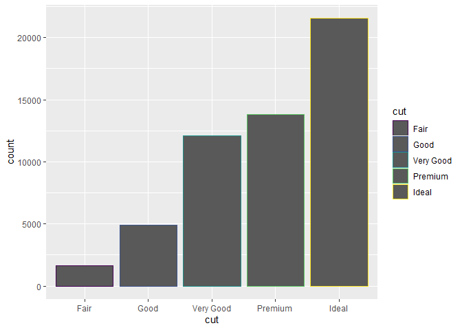<!-- -->

``` r
ggplot(data = diamonds)+
  geom_bar(mapping = aes(x = cut, fill = cut))
```

<!-- -->

``` r
ggplot(data =  diamonds)+
  geom_bar(mapping = aes(x = cut, fill = clarity))
```

<!-- -->

``` r
ggplot(data = diamonds, 
       mapping = aes( x = cut, fill = clarity))+
  geom_bar(alpha = 1/5, position = "identity")+
  coord_polar()
```

<!-- -->

``` r
ggplot(data = diamonds, mapping = aes( x= cut, color = clarity))+
  geom_bar(fill = NA, position = "identity")
```

<!-- -->

``` r
ggplot(data = diamonds, mapping = aes(x= cut, fill = clarity))+
  geom_bar(position = "fill")
```

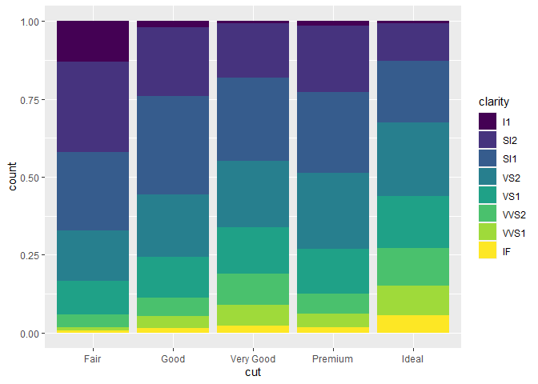<!-- -->

``` r
ggplot(data = diamonds, mapping = aes(x= cut, fill = cut))+
  geom_bar(position = "dodge")
```

<!-- -->

``` r
ggplot(data = mpg)+
  geom_point(mapping = aes(x=displ, y = hwy),
             position = "jitter")
```

<!-- -->

``` r
ggplot(data = mpg, mapping = aes(x = cty, y = hwy, color = class))+
  geom_point()+
  geom_jitter(width =0.5)
```

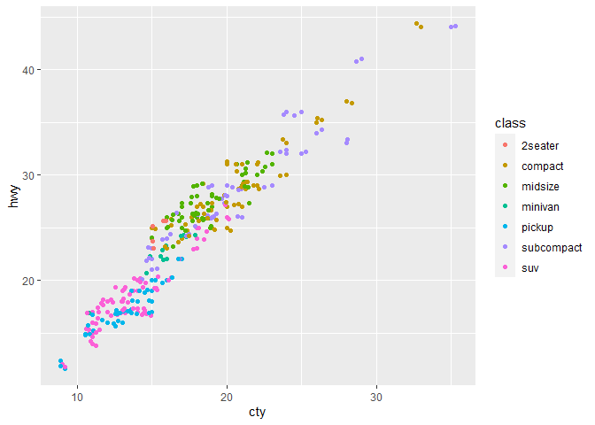<!-- -->

``` r
ggplot(data = mpg)+
  geom_boxplot(mapping = aes(x= class, y = hwy))+
  coord_flip()
```

<!-- -->

``` r
bar <- ggplot(data = diamonds)+
  geom_bar(mapping = aes(x = cut, fill = cut),
           show.legend = FALSE,
           width = 1)+
  theme(aspect.ratio = 1)+
  labs(x= NULL, y = NULL)

bar + coord_flip()
```

<!-- -->

``` r
bar + coord_polar()
```

<!-- -->

``` r
ggplot(data = mpg, mapping = aes(x = class, y = hwy)) +
  geom_boxplot() +
  coord_flip() +
  labs(y = "Highway MPG",
       x = "Class",
       title = "Highway MPG by car class",
       subtitle = "1999-2008",
       caption = "Source: http://fueleconomy.gov")
```

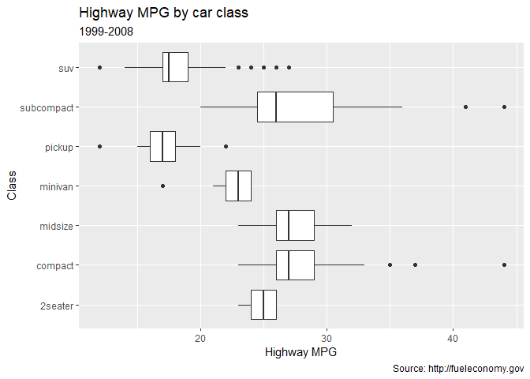<!-- -->
